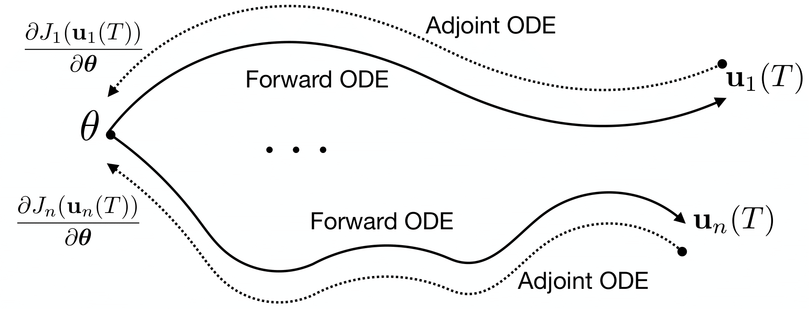

# *IFC*: Infinite-Fidelity Coregionalization for Physical Simulation

by [Shibo Li](https://imshibo.com), Wang Zheng, [Mike Kirby](https://www.cs.utah.edu/~kirby/) and [Shandian Zhe](https://www.cs.utah.edu/~zhe/)

<p align="center">
    <br>
    
    <br>
<p>

<h4 align="center">
    <p>
        <a href="https://arxiv.org/abs/2110.08432">Paper</a> |
        <a href="https://github.com/shib0li/Infinite-Fidelity-Coregionalization/blob/main/images/amaml-slides.pdf">Slides</a> 
<!--         <a href="https://github.com/shib0li/Infinite-Fidelity-Coregionalization/blob/main/images/poster.pdf">Poster</a>  -->
    <p>
</h4>


Model Agnostic Meta Learning (MAML) is widely used to find a good initialization for a family of tasks. Despite its success, a critical challenge in MAML is to calculate the gradient w.r.t. the initialization of a long training trajectory for the sampled tasks, because the computation graph can rapidly explode and the computational cost is very expensive. 

To address this problem, we propose Adjoint MAML (A-MAML). We view gradient descent in the inner optimization as the evolution of an Ordinary Differential Equation (ODE). To efficiently compute the gradient of the validation loss w.r.t. the initialization, we use the adjoint method to construct a companion, backward ODE. To obtain the gradient w.r.t. the initialization, we only need to run the standard ODE solver twice --- one is forward in time that evolves a long trajectory of gradient flow for the sampled task; the other is backward and solves the adjoint ODE. We need not create or expand any intermediate computational graphs, adopt aggressive approximations, or impose proximal regularizers in the training loss.  Our approach is cheap, accurate, and adaptable to different trajectory lengths. We demonstrate  the advantage of our approach in both synthetic and real-world meta-learning tasks. 


# System Requirements

We highly recommend to use Docker to run our code. We have attached the docker build file `env.Dockerfile`. Or feel free to install the packages with pip/conda that could be found in the docker file.

# Datasets of Physical Simulations

*Heat* equation data is included in this repository. You can generate other physical simulations datasets by yourself by running

```
python generate.py -domain=(Heat, Poisson, Burgers, TopOpt, NavierStockPRec/URec/VRec)

```
For *Buergers*, *Topology Optimization*, *NavierStock*, the solvers requires MATLAB support. The generated multi-fidelity data will saved in to `data/__raw__` folder


```
data/
├── __raw__/
│   └── Heat_8_128/
│       └──...
├── matlab_solvers
```

# Run

To run *IFC-ODE* $^2$
```
bash test-ODE.sh $DOMAIN $RANK $EPOCHS $DEVICE $FOLD $INTERVAL $DEPTH_A

```
To run *IFC-GPT*
```
bash test-GPT.sh $DOMAIN $RANK $EPOCHS $DEVICE $FOLD $INTERVAL 

```

* `$DOMAIN` name of physical problesm: *Heat*, *Poisson*, *Burgers*, *TopOpt*, *NavierStockPRec*(3D problem)
* `$RANK` dimension of latent ODE
* `$EPOCHS` maximum epochs 
* `$DEVICE` where to run, for example ***cuda:0*** or ***cpu***
* `$FOLD` fold index of dataset
* `$INTERVAL` frequency for saving the results
* `$DEPTH_A` (for *IFC-ODE* $^2$ only) depth of basis neural ODE


# License

IFC is released under the MIT License, please refer the LICENSE for details

# Getting Involved
Feel free to submit Github issues or pull requests. Welcome to contribute to our project!

To contact us, never hestitate to send an email to `shibo@cs.utah.edu` or `shiboli.cs@gmail.com` 
<br></br>


# Citation
Please cite our paper if you find it helpful :)

```

@inproceedings{
li2022infinitefidelity,
title={Infinite-Fidelity Coregionalization  for Physical Simulation},
author={Shibo Li and Zheng Wang and Robert Kirby and Shandian Zhe},
booktitle={Advances in Neural Information Processing Systems},
editor={Alice H. Oh and Alekh Agarwal and Danielle Belgrave and Kyunghyun Cho},
year={2022},
url={https://openreview.net/forum?id=dUYLikScE-}
}

```
<br></br>
